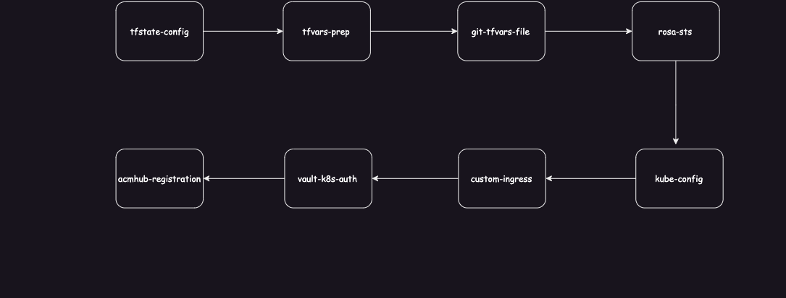

# ROSA HCP cluster automation

## Pre-Requisites

### Account Level
- [Detailed List](https://docs.openshift.com/rosa/rosa_planning/rosa-sts-aws-prereqs.html)

### Execution Level
- ROSA HCP [enabled](https://docs.aws.amazon.com/rosa/latest/userguide/getting-started-hcp.html#getting-started-hcp-step-1) and accounts linked
- IAM STS User with permission to:
  - Create Operator Roles
  - Create S3 Bucket (TF State Bucket)
  - Create, Delete ROSA
  - Create OIDC
  - Add Route53 HostedZone records
- VPC tagged with `cluster_name`
- Private and/or Public Subnets tagged with `cluster_name`
  - `x.x.x.x/24` CIDR for Multi-AZ
  - `x.x.x.x/25` CIDR for Single-AZ
  
- Base DNS Domain name if you intend to deploy a custom `IngressController`
- Additional Security Groups to apply to the cluster nodes (Master, Infra, Worker) tagged with `cluster_name`)
- ROSA OCM Token
- Cluster Name
- A HashiCorp Vault instance
- Vault Token or AppRole with permission to:
  - Add a PKI engine Role
  - Request TLS certificates
  - Create KeyVault secrets
  - Retrieve/Read KV secrets
- Vault Paths for retrieving the following:
  
  - Identity Provider Details. Look at the [idp-idp_name.tf](./rosa-classic/) files for a guide.
    
    For example: GitLab IDP credentials are stored at vault path `kv/identity-providers/dev/gitlab` and the the secret data below.
    ```json
      {
        "client_id": "<value>",
        "client_secret": "<value>",
        "gitlab_url": "https://gitlab.consulting.redhat.com/"
      }
    ```

  - ACMHUB cluster credentials (api_url, username, password)

    For example: ACMHUB cluster credentials are stored at vault path `kv/acmhub/<env>/<cluster-name>` and the secret data below.
    ```json
      {
        "api_url": "https://api.example.p1.openshiftapps.com:6443",
        "password": "<value>",
        "username": "<value>"
      }
    ```

  - OCM Token
  
    For example: The OCM token is stored at vault path `kv/rosa/ocm-token` and the secret data below.
    ```json
      {
        "ocm_token": "<value>"
      }
    ```

  - Github/GitLab Authentication Token
  
    For Example: The Git token is stored at vault path `kv/git/github/pat` and the secret data below.
    ```json
      {
        "git_token": "<value>"
      }
    ```

### Software Packages
- [GoLang](https://go.dev/doc/install) - 1.20.x or greater
- [Terraform](https://developer.hashicorp.com/terraform/install#linux) 1.5.x or greater
- [Openshift Client](https://mirror.openshift.com/pub/openshift-v4/x86_64/clients/ocp/latest)
- [rosa cli](https://mirror.openshift.com/pub/openshift-v4/x86_64/clients/rosa/latest/)
- [AWS CLI v2.x](https://docs.aws.amazon.com/cli/latest/userguide/getting-started-install.html)
- [jq](https://jqlang.github.io/jq/download/)

## Execution Flow



## Admin variables

These are the cross-module [variables](./tfvars/admin/admin.tfvars) that are common across business units.

## User input variables

[Variables](.ci/user-inputs.sh.example) the user provides during the execution of the pipeline. Copy it to `.ci/user-inputs.sh` (gitignored) and fill in your values.

## Derived variables

These are the [variables](./tfvars-prep/variables.tf) that change based on user inputs.

## Terraform Modules

Listed in their order of precedence, they work together to provision a ROSA cluster, make necessary configurations and then register the cluster to ACM for day-2 configurations and management.

- [tfstate-config](./tfstate-config/): Create an S3 bucket for remote state storage.
- [account-setup](./account-setup/): Create necessary AWS resources such as VPC, Subnets, NAT Gateways, Account Roles. Security Groups..etc. This module is optional if you choose to implement account setup through other means.
- [tfvars-prep](./tfvars-prep/): Combine admin, user inputs, and dynamic variables into a master tfvars file. All subsequent modules will use the master tfvars file.
- [git-tfvars-file](./git-tfvars-file/): Commit the master tfvars file to GitHub. Feel free to change the repo location to GitLab, BitBucket...etc.
- [rosa-hcp](./rosa-hcp/): Creates the ROSA cluster, deploys two identity providers (GitHub, GitLab), and then writes the cluster-admin credentials to Vault.
- [kube-config](./kube-config/): Create two `kubeconfig` files. One for the ROSA cluster and another for the ACMHUB cluster.
- [custom-ingress](./custom-ingress/): Deploys an additional IngressController.
- [vault-k8s-auth](./vault-k8s-auth/): Deploy the vault-kubernetes-authentication backend for apps running on the cluster to be able to read Vault secrets.
- [acmhub-registration](./acmhub-registration/): Registers the ROSA cluster to  ACMHUB.

## Implementation

### Cluster Build

1. Have an OpenShift cluster with [ACM Deployed](https://access.redhat.com/documentation/en-us/red_hat_advanced_cluster_management_for_kubernetes/2.10/html-single/install/index#installing-while-connected-online). We'll use this as the HUB cluster.
2. A Vault instance. In this guide, [Vault is deployed](./.ci/vault-deploy.sh) in the same OpenShift cluster where ACM is running. The root token can be found in the **vault-init** `Secret` in the **vault** `Namespace`.
3. Set the [admin](./tfvars//admin//admin.tfvars) variables. These are the variables that are common across all business units. Hence, setting them once should suffice.
4. Set the user-inputs variables. These change for each new cluster, or distinct business unit, or if you need to update existing clusters.
 
	    
	    ```sh
	    cp .ci/user-inputs.sh.example .ci/user-inputs.sh
	    ${EDITOR:-vi} .ci/user-inputs.sh
	    ```

5. Now run the [pipeline script](.ci/pipeline-create.sh)

    From the root directory, run the script. We could translate this shell script into a proper CICD process such as Jenkins, GitHub Actions, Tekton..etc; with sensitive variables read from Vault, or some secret engine. 
    
    For example, AWS credentials, OCM Token, Git Token, Vault Token could be set as environment variables via a plugin.

    ```sh
    .ci/pipeline-create.sh | tee rosa-hcp-create.log
    ```

### Cluster Tear Down

```sh
.ci/pipeline-destroy.sh | tee rosa-hcp-destroy.log
```

